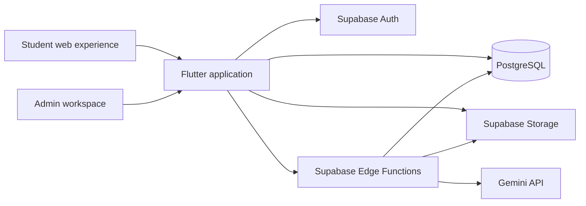

# TestSquared

**An AI-assisted past-paper revision platform designed to make exam practice more structured, accessible, and actionable.**

TestSquared brings question discovery, topic-based practice, answer review, AI-assisted feedback, progress tracking, and content management into one Flutter web application. Students can study by subject, year, or topic, while administrators can turn uploaded papers and mark schemes into structured question content.

> **Project status:** Completed MVP built as a four-person university entrepreneurship project. The previous Vercel deployment is currently offline, so this README does not include an active live demo or showcase video. A production web build has been verified locally with Flutter 3.38.5 and Dart 3.10.4.

## Why we built it

Past-paper revision often requires students to move between scattered PDFs, mark schemes, notes, and progress records. Finding a relevant question is easy; turning repeated practice into a structured learning process is harder.

TestSquared explores a more connected workflow:

- organise past-paper content by subject, year, and topic;
- let students practise individual questions instead of navigating entire PDFs;
- combine official answers with AI-assisted feedback;
- retain bookmarks, notes, attempts, and progress between sessions;
- give administrators tools to import and maintain question content without manually rebuilding every paper.

## Core experience

### Student workspace

- Create an account, sign in, and recover access through Supabase Authentication.
- Explore subjects and past papers by year or topic.
- Work through multiple-choice and structured questions.
- Review official answers and explanations.
- Submit answers for AI-assisted checking and feedback.
- Ask contextual questions through an integrated AI chat panel.
- Search the question bank using text and filters.
- Save bookmarks, organise them into folders, and attach personal notes.
- Review question attempts, topic progress, mastery indicators, and learning streaks.
- Adjust accessibility and interface preferences.

### Admin workspace

- Upload question papers and corresponding mark schemes.
- Associate content with a curriculum, subject, year, and paper type.
- Trigger AI-assisted extraction of questions from uploaded PDFs.
- Match extracted questions with mark-scheme content.
- Render pages and crop figures required by individual questions.
- Review, edit, organise, and manage structured question content.
- Inspect basic platform analytics and user records.

## How the system works



The Flutter application provides both the student and administrator experiences. Supabase supplies authentication, relational data, file storage, and serverless Edge Functions.

Privileged database operations and Gemini requests are handled inside Edge Functions. Service-role credentials and AI keys are read from server-side environment variables rather than being exposed in the Flutter client.

## Paper-processing workflow

An uploaded paper moves through several stages:

1. The administrator selects the curriculum, subject, year, and paper metadata.
2. The question paper and optional mark scheme are uploaded to Supabase Storage.
3. Edge Functions analyse the documents and extract question structures.
4. Mark-scheme content is processed and matched with the relevant questions.
5. Pages containing diagrams or figures can be rendered and cropped.
6. The administrator reviews and edits the generated content before it becomes part of the question bank.

AI output is treated as draft content for human review rather than automatically accepted as authoritative.

## Engineering decisions

### Server-side AI integration

Gemini requests are routed through Supabase Edge Functions. This keeps API credentials outside the Flutter application and allows AI workflows to access the database and storage through controlled server-side operations.

### Structured question representation

The application supports multiple-choice and structured questions rather than treating every paper as one PDF. Questions, answer blocks, figures, topics, attempts, and mark-scheme data can therefore be rendered and tracked independently.

### Shared student and admin application

Student and administrator workflows live in the same Flutter project but use separate routes and role-aware interfaces. This reduces duplicated client infrastructure while keeping content-management tasks outside the normal student navigation.

### Progress tied to individual attempts

Progress is based on question attempts and topic-level records. This allows the interface to present mastery indicators, attempt states, daily activity, and topic progress without relying only on whole-paper completion.

### Searchable question bank

Question content is stored as structured data and queried through Supabase, enabling full-text search and filters instead of requiring students to manually inspect PDF files.

## Tech stack

| Layer | Technologies |
| --- | --- |
| Client | Flutter, Dart |
| Navigation and state | go_router, Riverpod, Provider |
| Backend platform | Supabase |
| Data | PostgreSQL, Supabase migrations |
| Authentication | Supabase Auth |
| Storage | Supabase Storage |
| Serverless backend | Supabase Edge Functions, Deno, TypeScript |
| AI integration | Gemini API |
| Document handling | Syncfusion Flutter PDF Viewer, File Picker |
| Charts and progress UI | fl_chart |
| Deployment workflow | GitHub Actions, Vercel |
| Local tooling | Flutter CLI, Supabase CLI, npm |

## Project structure

```text
test_squared/
├── lib/
│   ├── core/                    # Routing, themes, services, providers, and shared assets
│   ├── features/
│   │   ├── auth/                # Sign-in, registration, and password recovery
│   │   ├── dashboard/           # Subject and paper discovery
│   │   ├── past_papers/         # Questions, papers, answer review, and AI chat
│   │   ├── progress/            # Attempts, topic progress, and learning statistics
│   │   ├── bookmarks/           # Bookmark folders, notes, and image annotations
│   │   ├── search/              # Full-text question search and filters
│   │   └── settings/            # Accessibility preferences
│   └── pages/admin/             # Upload, review, editing, analytics, and user management
├── supabase/
│   ├── functions/               # AI, PDF, answer-checking, and content-processing workflows
│   ├── migrations/              # Database schema and policy changes
│   └── config.toml              # Supabase local-development configuration
├── test/                        # Flutter test sources
├── .github/workflows/           # Web build and Vercel deployment workflow
├── pubspec.yaml
└── vercel.json
```

## Run locally

### Prerequisites

- Flutter 3.38.x
- Dart 3.10.x
- Chrome or another supported Flutter target
- A Supabase project for backend-dependent functionality
- Node.js and npm when using the Supabase CLI

### 1. Clone the repository

```bash
git clone https://github.com/cloudnine-ddy/test_squared.git
cd test_squared
```

### 2. Install Flutter dependencies

```bash
flutter pub get
```

### 3. Start the Flutter web application

```bash
flutter run -d chrome
```

### 4. Generate a production web build

```bash
flutter build web --release
```

The production web build was verified with Flutter 3.38.5 and Dart 3.10.4.

## Backend setup notes

Full functionality depends on a configured Supabase environment containing the required database schema, storage buckets, authentication settings, Edge Functions, and server-side secrets.

The repository includes Supabase migrations and Edge Function source code, but clean provisioning of a completely new hosted environment has not been verified as part of this portfolio pass.

For an isolated environment:

1. Create or start a Supabase project.
2. Apply the migrations under `supabase/migrations`.
3. Deploy or locally serve the functions under `supabase/functions`.
4. Configure the Flutter client with the project URL and public anon key.
5. Configure `GEMINI_API_KEY` as an Edge Function secret.
6. Keep the Supabase service-role key and Gemini key out of the repository.

Do not commit service-role credentials, AI API keys, or local secret files.

## Deployment

The repository contains a GitHub Actions workflow that:

1. installs Flutter;
2. retrieves project dependencies;
3. builds the Flutter web application;
4. installs the Vercel CLI; and
5. deploys the generated build using repository secrets.

The previous Vercel deployment is currently unavailable. A future deployment will require valid `VERCEL_TOKEN`, `VERCEL_ORG_ID`, and `VERCEL_PROJECT_ID` repository secrets.

## Current limitations

- The previous public Vercel deployment is offline.
- No portfolio video or current public demo is included at this stage.
- Automated test coverage is incomplete, and the existing widget test is an outdated Flutter template rather than a representative product test.
- `flutter build web --release` succeeds, but `flutter analyze` is not currently clean because the repository still contains legacy or unused files and unresolved analyzer findings.
- Some migrations and AI prompts reflect earlier curriculum experiments and require consolidation before production use.
- A clean, independent Supabase environment has not yet been provisioned and validated from scratch.
- AI-generated extraction and feedback require human review and should not be treated as authoritative marking.
- Production readiness would require broader security, accessibility, usability, and reliability testing.

## Team and personal contribution

TestSquared was developed as a **four-person team project** for a university entrepreneurship unit. The product concept and overall result belong to the team.

I contributed as a core full-stack developer across:

- student and administrator Flutter interfaces;
- authentication and Supabase data integration;
- paper upload, question-management, and answer-checking workflows;
- Supabase Edge Functions for AI-assisted processing;
- Gemini-powered paper analysis and answer feedback;
- GitHub Actions and Vercel deployment; and
- custom-domain configuration.

These contributions describe my personal implementation work without claiming sole ownership of the complete team product.

## License

No open-source license has been added. All rights are reserved by the project contributors unless a license is provided later.